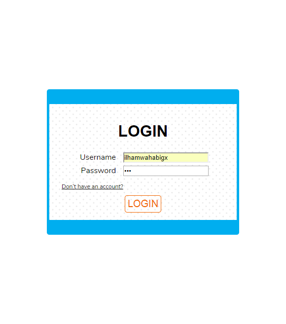
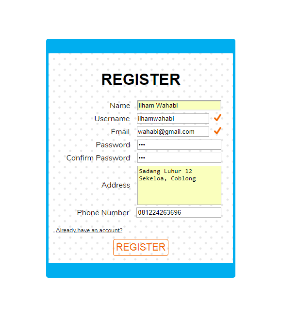
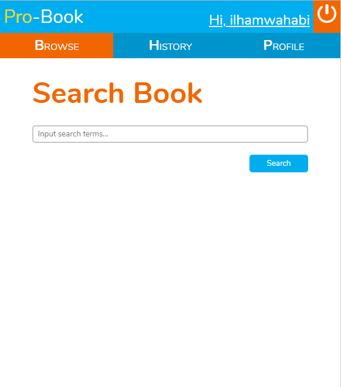
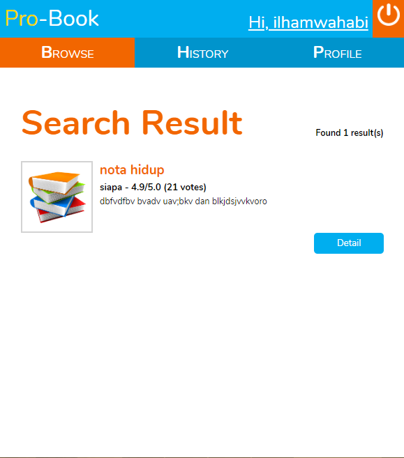
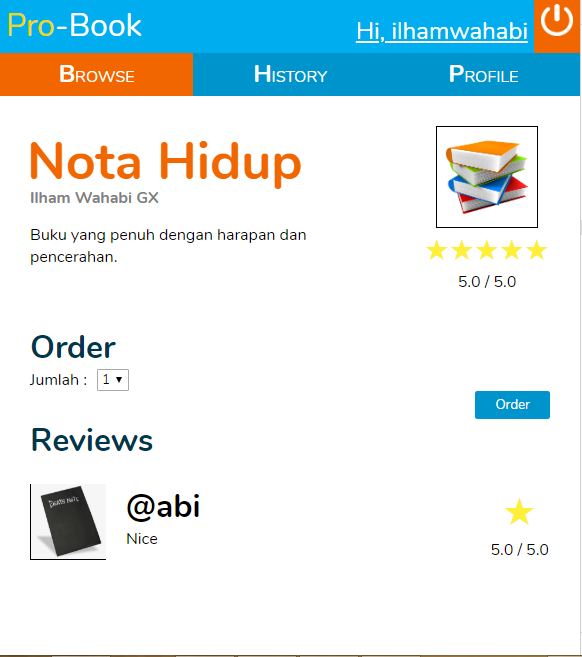
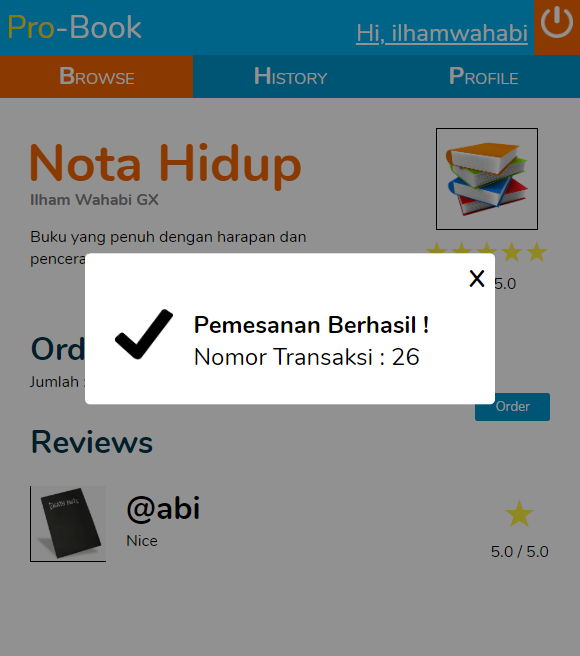
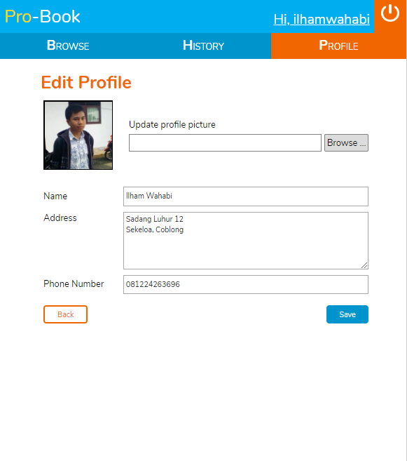
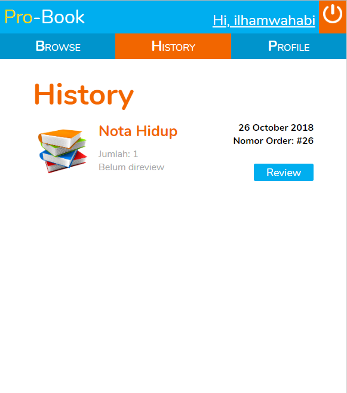
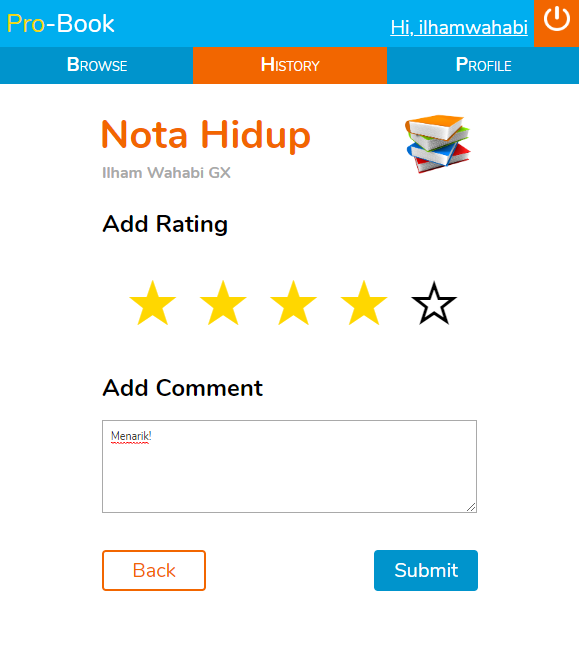

# Bookstore Web

## Usage
Turn on your `MySQL` database and `Apache` each time you do this.

In `server` folder create `config.php` file, fill it with your credentials. For example:
```php
  <?php
    $dbhost = 'localhost';
    $dbuser = 'root';
    $dbpass = '';
    $dbname = 'bookstore';
  ?>
```

> Run `php server/dump.php` to connect server, make database (if not exist) and import dumpfile.
> Do this process at first time only.

1. Run `php -S 127.0.0.1:8080` to serve the back end side (although its serve front end side too)
2. Access one of endpoint with the filename, example `http://127.0.0.1:8080/server/api/get_books.php`

## Dokumentasi

### Login

- Menerima masukan username dan password
- Input divalidasi dengan javascript, serta akan dilakukan pengecekan pada database setelah di-submit
- Bila benar, cookie akan di-set dan user diarahkan kepada halaman browse

### Register

- Menerima data user berupa nama, username, email, alamat, nomor telepon
- Username dan Email harus unik terhadap data pada database (pengecekan dilakukan tiap key up)
- Input divalidasi menggunakan javascript, serta akan dilakukan pengecekan pada database setelah di-submit
- Bila berhasil, cookie akan di-set dan user diarahkan kepada halaman browse

### Header (logout)
- Mendapat informasi username dari cookie
- Kemudian menampilkannya untuk setiap halaman yang memanggil header
- Bila user menekan tombol pojok kanan atas, user akan logout dengan menghapus cookie dan dialihkan ke laman login

### Search dan Search-Result


- Menerima masukan kata kunci untuk mencari buku
- Dilakukan validasi tidak boleh kosong dengan javascript
- Kemudian, user akan diarahkan kepada laman hasil pencarian buku
- User dapat melihat detil dari buku dengan menuju laman book-detail

### Book-details


- Menampilkan detil informasi dari buku dan hal terkait seperti rating dan comment
- Saat pemesanan sukses dilakukan akan menampilkan notifikasi
- Nilai rating diperoleh dari hasil akumulasi rating terhadap buku tersebut

### Profile dan Edit-Profile


- Menampilkan informasi-informasi user
- User dapat menuju laman edit profile untuk melakukan perubahan pada beberapa informasi termasuk meng-upload foto profil
- Dilakukan validasi pada edit-profile dengan javascript
- Setelah di-submit, perubahan akan dikirim ke dalam database

### History

- Menampilkan semua riwayat pemesanan buku oleh seorang user
- Ditampilkan dalam bentuk list dengan informasi terkait buku dan pemesanan
- Terdapat tombol review untuk pemesanan yang belum di-review

### Review

- User dapat memberikan rating dan comment terhadap pesanan buku
- Dilakukan validasi tidak boleh kosong dengan javascript
- Disediakan tombol back bila user ingin mengurungkan penilaiannya
- Setelah di-submit, data review akan ditambahkan ke dalam database

Pembagian Tugas

Tampilan
1. Login : 13516141
2. Register : 13516141
3. Header : 13516051
4. Profile : 13516051
5. Edit Profile : 13516051
6. History : 13516150
7. Review : 13516150
8. Search : 13516141
9. Search Result: 13516141
10. Book-details : 13516051

Fungsionalitas
1. Login : 13516141, 13516051
2. Logout: 13516141
3. Register : 13516150, 13516141
3. Melihat Profile : 13516051
4. Mengedit Profile : 13516051
5. Melihat Riwayat Pemesanan : 13516150
6. Menambahkan Review Buku : 13516150, 13516141
7. Melakukan Pencarian Buku : 13516141
8. Melakukan Pemesanan Buku : 13516141

Bonus
1. Star Rating : 13516150
2. Access Token : 13516141
3. Order Modal : 13516051